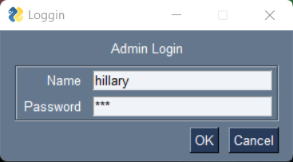
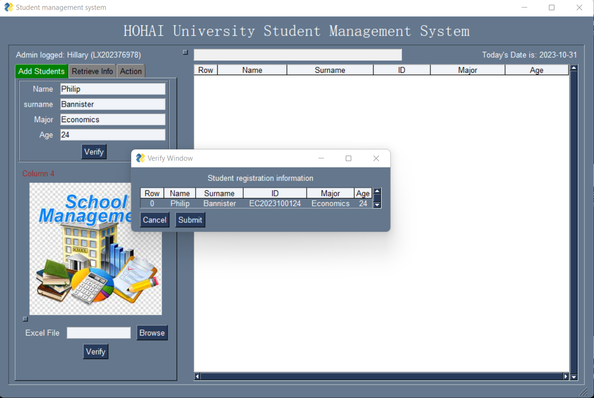
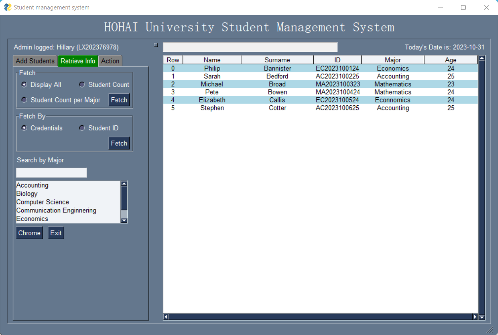

# Python-Student-Database-Management-System (PySimpleGUI + Sqlite3)
This project is a simple student database management system made with PySimpleGUI and Sqlite3 for educational purposes. This project is basically for registering students in a school environment given the basic details of a student such as name, major enrolled, and age. The system is designed to automatically generate and asign unique student IDs to every enrolled student which should match the same format for all students  
### Admin User can
- Add Student records
- Update student data
- Fetch particular students in the database
- delete student records

#### Login Window


#### Main Window



#### Main Window/ Fetch Students



## Directory StructureR
```bash
STUDENT_ANAGEMENT/
|-- backend/
|   |-- db_sql.py
|   |-- students_enrolled.db
|   |-- students_utility.py
|   | 
| 
|-- guis/
|   |-- mainwindowGUI.py
|   |   
|
|-- main.py
|
|
|-- projectsnaphots
|   |-- shot1.png
|   |-- shot2.png
|   |-- shot2.png
|
|-- .gitignore
|-- README.md
|-- pyproject.toml
```